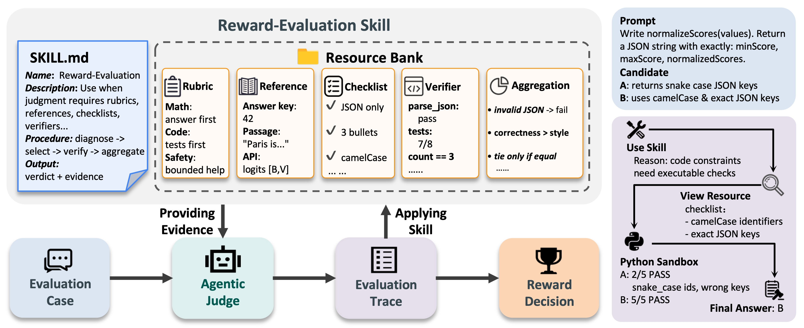

<div align="center">
<h1>Skill-RM: Unifying Heterogeneous Evaluation Criteria via Agent Skill</h1>

<a href="https://github.com/Qwen-Applications">
  
</a>
<a href="https://arxiv.org/abs/2606.03980">
  
</a>
<a href="https://github.com/Qwen-Applications/Skill-RM">
  
</a>
<a href="https://opensource.org/licenses/Apache-2.0">
  
</a>

<p align="center">
  <i><b> Qwen Large Model Application Team, Alibaba</b></i>
</p>

Skill-RM is a unified reward-modeling framework that reformulates reward
evaluation as the execution of reusable <b>Reward-Evaluation Skills</b>.
Instead of handling rule-based verifiers, ground-truth references, procedural
checklists, and complex rubrics with separate ad hoc mechanisms, Skill-RM gives
the judge model a consistent agentic interface for selecting evidence, invoking
tools, and aggregating the final reward decision for each input.

<p align="center">
  
</p>

<p align="center">
  <i>Skill-RM organizes reward evaluation around reusable skills, resource banks,
  tool-assisted verification, and evidence-based reward decisions.</i>
</p>

</div>

This repository provides the official Skill-RM code, reward-evaluation skill
packages, and reproduction scripts for reward benchmarks, best-of-N selection,
IF-RewardBench, and instruction-following RL.


## Installation

```bash
python -m venv .venv
source .venv/bin/activate
pip install -e .
```

For local development checks:

```bash
pip install -e ".[dev]"
pytest -q
```

## Serving a Judge Model

The runners use OpenAI-compatible chat-completions endpoints. vLLM is one
supported serving option:

```bash
export MODEL_DIR="/path/to/Qwen3.5-27B"
export MODEL_NAME="Qwen3.5-27B"

vllm serve "$MODEL_DIR" \
  --served-model-name "$MODEL_NAME" \
  --host 0.0.0.0 \
  --port 8000 \
  --tensor-parallel-size 1 \
  --enable-auto-tool-choice \
  --tool-call-parser qwen3_coder \
  --reasoning-parser qwen3 \
  --language-model-only
```

Point Skill-RM to the served endpoint:

```bash
export SKILLRM_MODEL="Qwen3.5-27B"
export SKILLRM_BASE_URLS="http://127.0.0.1:8000/v1"
python scripts/check_endpoints.py --chat
```

For multiple endpoints, separate base URLs with commas.

Endpoint URLs and data paths can also be supplied through `.env`:

```bash
cp .env.example .env
# Fill in endpoint and data paths.
source .env
```

By default, Qwen thinking is disabled for judge calls. Compatible endpoints
receive `chat_template_kwargs={"enable_thinking": false}`; endpoints that do
not support that field are retried without it. Use `--enable-thinking` only
when intentionally evaluating a thinking-mode judge.

## Data Preparation

Prepare benchmark data and model checkpoints separately, then point the runners
to those paths or served endpoints with environment variables. This repository
provides source links, expected file layouts, and validation commands.

```text
OpenRS:          https://github.com/Qwen-Applications/OpenRS
JETTS:           https://github.com/SalesforceAIResearch/jetts-benchmark
IF-RewardBench:  https://github.com/thu-coai/IF-RewardBench
```

The main reward-judging experiments expect an OpenRS-compatible data root:

```bash
export SKILLRM_DATA_HOME="$HOME/skillrm_data"
export SKILLRM_DATA_ROOT="$SKILLRM_DATA_HOME/openrs_data"
```

Expected files:

```text
$SKILLRM_DATA_ROOT/rewardbench_v2/rewardbench_v2.jsonl
$SKILLRM_DATA_ROOT/judgebench/gpt.jsonl
$SKILLRM_DATA_ROOT/judgebench/claude.jsonl
$SKILLRM_DATA_ROOT/rmbench/rmbench.jsonl
```

See [docs/data_preparation.md](docs/data_preparation.md) for copy-paste setup
commands and validation checks for OpenRS, JETTS, and IF-RewardBench.

## Quick Check

After preparing external data and sourcing `.env`, validate the local setup:

```bash
python scripts/check_data_paths.py
python scripts/check_endpoints.py --chat
```

Run a small partial job before launching full experiments:

```bash
python -m skillrm.runners.rewardbench2 \
  --config configs/rewardbench2/skill_fair.yaml \
  --output outputs/quick_check/rewardbench2_skill_fair \
  --limit 20 \
  --workers 4

python -m skillrm.runners.pairwise \
  --config configs/judgebench/skill_fair.yaml \
  --output outputs/quick_check/judgebench_skill_fair \
  --limit 20 \
  --workers 4
```

## Skills

| Skill | Path | Used by |
| --- | --- | --- |
| `reward_judge_fair` | `skills/reward_judge_fair/` | Standard-input RewardBench2, JudgeBench, RM-Bench, and JETTS runs. |
| `reward_judge_operational` | `skills/reward_judge_operational/` | Resource-available RewardBench2, JudgeBench, RM-Bench, and JETTS runs. |
| `instruction_following` | `skills/instruction_following/` | IF-RewardBench agentic runs. |

## Experiment Settings

| Setting | Description |
| --- | --- |
| `baseline` | Direct LLM-as-a-judge baseline. The model sees the prompt and candidate responses, then emits the reward judgment directly. |
| `skill_fair` | Standard-input Skill-RM. The model can self-select a reusable reward-evaluation skill without exposing benchmark metadata, references, ground truth, or labels. |
| `skill_operational` | Resource-available Skill-RM. The same skill interface may expose protocol-specified resources when available, such as task metadata, references, checklists, verifiers, and benchmark-provided evidence. |

The ablation runner supports the resource-use controls used in the paper:

| Ablation | Description |
| --- | --- |
| `fair_flat_prompt` | Standard-input skill text/resources flattened into the prompt. |
| `flat_prompt` | Resource-available skill text and sample resources flattened into the prompt. |
| `tool_only` | Baseline prompt plus visible-text tools, without skill resources. |

## Main Reward-Judging Experiments

Run one benchmark and setting:

```bash
bash scripts/run_one.sh rewardbench2 baseline
bash scripts/run_one.sh judgebench skill_fair
bash scripts/run_one.sh rmbench skill_operational
```

Run the full main matrix for one model:

```bash
bash scripts/run_release_model.sh qwen35_27b outputs/paper_main/qwen35_27b
python scripts/summarize_official_acc.py outputs/paper_main/qwen35_27b
```

Run the resource-use ablations:

```bash
bash scripts/run_ablation_model.sh qwen35_27b outputs/ablations/qwen35_27b
python scripts/summarize_official_acc.py outputs/ablations/qwen35_27b
```

The main metrics follow each benchmark's official or full-set definition:

```text
RewardBench2: official leaderboard average
JudgeBench:   order-swapped aggregation over merged GPT and Claude subsets
RM-Bench:     win / total
```

Supported model keys for the bundled launch scripts:

```text
qwen35_9b
qwen35_27b
qwen35_35b_a3b
qwen35_122b_a10b
```

The model key sets the served model name and default worker count. Actual
endpoint URLs must be supplied through `SKILLRM_BASE_URLS`.

## Best-of-N Experiments

The JETTS runner evaluates best-of-N answer selection. It compares candidate
answers with a pairwise judge and uses sequential knockout to select a final
answer from the candidate set.

```bash
export JETTS_DATA_DIR="/path/to/jetts/reranking_and_refinement"
bash scripts/run_jetts_seqko.sh configs/jetts_seqko/qwen72b.example.yaml
```

The JETTS config includes the `baseline` setting used for the paper's
direct-judge best-of-N experiments.

## IF-RewardBench Experiments

IF-RewardBench runs support `overall` and `constraint` evaluation. The agentic
setting exposes only the `instruction_following` skill by default.

```bash
export SKILLRM_IF_REWARDBENCH_ROOT="/path/to/IF-RewardBench-main"
bash scripts/run_if_rewardbench.sh overall if_rb_overall_agentic
bash scripts/run_if_rewardbench.sh constraint if_rb_constraint_agentic
```

The official `overall` value reported by this repository is
`if_rewardbench.overall.kendall`.

## Instruction-Following RL

The instruction-following RL experiment is implemented as a pointwise Skill-RM
reward recipe for an external `verl` checkout. The recipe covers the
`skill_mounted_verifier_plus_code` setting used with GRPO and VerInstruct.

See [docs/rl_reproduction.md](docs/rl_reproduction.md) for the recipe
installation, compatible `verl` version check, VerInstruct data conversion,
policy model download, reward smoke test, and GRPO launch template.

## Experiment Outputs

Experiment outputs are written under the output directory passed to the launch
script. Typical files include:

```text
predictions.jsonl
metrics.json
summary.md
summary_official_acc.md
```

## Repository Structure

```text
Skill-RM/
├── assets/                      Framework figures used by README
├── configs/                     Experiment configuration templates
│   ├── rewardbench2/
│   ├── judgebench/
│   ├── rmbench/
│   ├── jetts_seqko/
│   └── if_rewardbench/
├── skillrm/                     Core RewardBench2, JudgeBench, and RM-Bench code
│   ├── runners/                 Public CLIs
│   ├── benchmarks/              Benchmark data, prompt, parser, and metrics
│   ├── common/                  IO, config, client, parsing, and stats helpers
│   └── runtime/                 Skill loading, resources, and sandbox runtime
├── skills/                      Reusable reward-evaluation skill packages
│   ├── reward_judge_fair/
│   ├── reward_judge_operational/
│   └── instruction_following/
├── experiments/
│   ├── jetts_seqko/             Best-of-N sequential knockout runner
│   └── if_rewardbench/          IF-RewardBench runner
├── integrations/
│   └── verl/                    Pointwise IF-RL recipe for external verl
├── scripts/                     Launch, validation, and summarization scripts
├── docs/                        Data setup, reproduction, and architecture notes
└── tests/                       Smoke and parity tests
```

See [docs/architecture.md](docs/architecture.md) for the module-level layout.

## License

This project is released under the [Apache License 2.0](LICENSE).

## Citation

If you find our work useful in your research, please consider citing our paper:

```bibtex
@misc{chen2026skillrm,
      title={Skill-RM: Unifying Heterogeneous Evaluation Criteria via Agent Skill},
      author={Tao Chen and Gangwei Jiang and Pengyu Cheng and Siyuan Huang and Yihao Liu and Jingwei Ni and Jiaqi Guo and Mengyu Zhou and Kai Tang and Junling Liu and Qinliang Su and Xiaoxi Jiang and Guanjun Jiang},
      year={2026},
      eprint={2606.03980},
      archivePrefix={arXiv},
      primaryClass={cs.LG},
      url={https://arxiv.org/abs/2606.03980},
}
```
